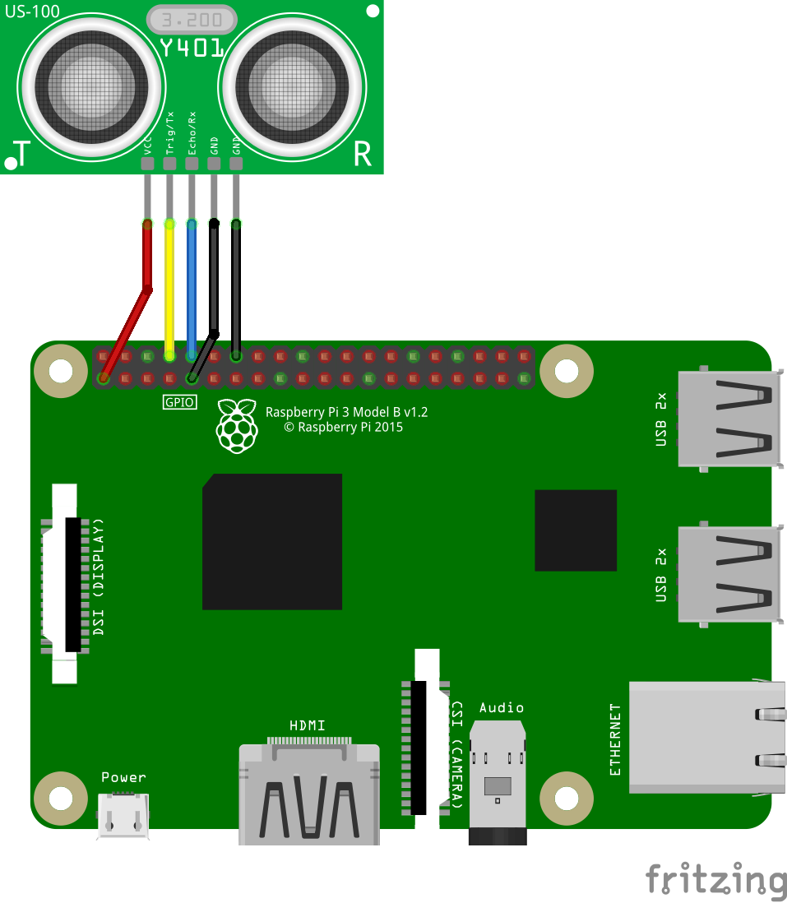

# CatTube (aka Murderbox)

With this system you can load up videos your cats like onto a Raspberry Pi
and an ultrasonic sensor will let them watch the videos whenever they want.
We've had this running for about 3 years in our living room and two of our
cats use it multiple times a day. Often getting quite violent with the 
monitor when it shows particularly tasty rodents. Hence us calling it the
Murderbox.

## Hardware

- Raspberry Pi 3, 4, Zero, or Zero 2. Zero 2 is recommended over Zero as
it's much faster and the video-start latency is significantly lower.
- HDMI-capable monitor/TV. As mentioned, our cats can get
pretty...aggressive on some videos, so we installed a wall-mount TV bracket
that can swivel
- US-100 ultrasonic sensor. These can be found at several electronics
supply places, including [Adafruit](https://www.adafruit.com/product/4019).
- Wires to connect the sensor to the Pi. If your Pi has headers, then
F-F jumper wires will work. For attaching to my headerless Pi Zero, I
took the header off the US-100 and soldered the wires at both ends

## Hookup

Make the following connections between the US-100 and the Raspberry Pi:
| US-100     | Raspberry Pi |
| ---------- | ---------- |
| VCC        | Pin 1 (+3V3) |
| Trig/Tx    | Pin 8 (TXD0 UART, aka GPIO14) |
| Echo/Rx    | Pin 10 (RXD0 UART, aka GPIO15) |
| GND (1)    | Pin 9 (GND) |
| GND (2)    | Pin 14 (GND) |




## Software

Install [Raspberry Pi OS](https://www.raspberrypi.com/software/). Use the default operating system option.


From the desktop menu go to `Preferences` > `Raspberry Pi Configuration` and do the following:
1. Go to the `Display` tab and set `Screen Blanking` to `Disable`
2. Go to the `Interfaces` tab and set `Serial Port` to `Enable` 

Click Ok and select Yes when asked to reboot.


Open a terminal and run the following commands:
```
$ git clone https://github.com/lendot/cat-videos.git
$ cd cat-videos
$ pip install -r requirements.txt
$ cp cattube.desktop ../Desktop
$ sudo cp cattube.desktop /etc/xdg/autostart
```

### Configuration
The configuration file is in `~/cat-videos/config.yaml`. It can be edited with any text editor. The following settings can be tweaked there:

| Setting      | Default                  | Description |
| -------      | -------                  | ----------- |
| video_dir    | /home/pi/Videos          | Location of videos to play |
| distance     | 50                       | Maximum distance (cm) at which sensor will activate | 
| play_clips   | False                    | If False, videos are played in their entirety. If True, random shorter subsections are played |
| clip_duration| 180                      | If play_clips is True, the length of clips (in seconds) to play |
| sensor_device| /dev/ttyS0               | If you need to use a different serial device, set it here |
| mute         | False                    | Set to True to mute audio tracks on videos |

play_clips is useful if you have longer videos and don't want the cats to get bored watching them all the way through.
Clip durations betwen about 120s and 300s seem to work well for our cats.

## Enclosure

At minimum, you'll need some way to hold the sensor in place somewhere
at cat-level while making sure the transmit/receive units are unobstructed.
If you have access to a 3D printer, .stl files are
included for wall-mount enclosures. Ours mounts under the TV.


## Tips For Videos
We've found that the best videos are ones filmed from a single, stationary camera. If the camera is moving,
or the video is cutting between multiple cameras, it gets more confusing for the cats to track. Youtube has
a lot of good single camera animals-in-nature videos and the like that our cats take really well to.

I recommend trying a bunch of different types of videos to see what your cat responds to. 
In addition to the nature videos ours also like videos of animated critters and stuff like balls rolling around.
They're even sometimes interested in gameplay videos from stuff like Tetris or Centipede.
A while back I put an OK Go video on ours just for laughs and it turns out our cats really like watching it.
You never know what might grab their attention.

CatTube uses vlc to play the videos. The version that comes with Raspberry Pi OS isn't 
compiled with hardware acceleration enabled, which limits performance.
The Pi 3 I'm testing on can handle standard 1K HD <= 30 FPS fine, but 4k or higher
frame rates give it trouble. If a video is playing really slowly, or is giving
a black screen, you may need to decrease the resolution and/or frame rate.
