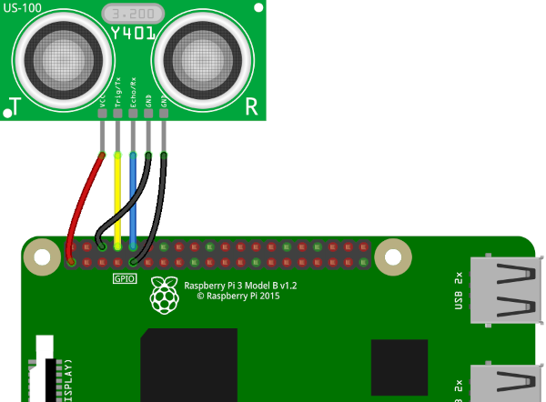
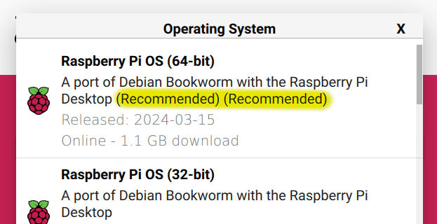

# CatTube
### On-demand Video Entertainment For Cats

## 1. Intro
Cat walks up to screen, videos start playing. Cat walks away from screen,
videos stop playing. That's the gist of CatTube. A Raspberry Pi with an
ultrasonic distance sensor attached is given the CatTube software and
whatever videos a particular cat likes to watch, and when the sensor
detects they're within range, the videos will start playing until they 
leave.

We've had this system running for about 3 years in our living room and
two of our cats love it and use it multiple times a day. Not only that,
they grasped it intuitively right from the beginning and there really wasn't
any training required.

## 2. Hardware

- Raspberry Pi 3, 4, or Zero 2
- HDMI-capable monitor/TV
- US-100 ultrasonic sensor. These can be found at several electronics
supply places, including [Adafruit](https://www.adafruit.com/product/4019).
- Wires to connect the sensor to the Pi. If your Pi has headers, then
F-F jumper wires will work. If you 3D print the supplied enclosure design,
3" jumpers work best. For attaching to my headerless Pi Zero 2, I took the
header off the US-100 and soldered the wires at both ends

### 2.1. Hookup

Make the following connections between the US-100 and the Raspberry Pi:
| US-100     | Raspberry Pi |
| ---------- | ---------- |
| VCC        | Pin 1 (+3V3) |
| Trig/Tx    | Pin 8 (TXD0 UART, aka GPIO14) |
| Echo/Rx    | Pin 10 (RXD0 UART, aka GPIO15) |
| GND (1)    | Pin 6 (GND) |
| GND (2)    | Pin 9 (GND) |



I haven't gotten around to investigating why this sensor breaks out
2 grounds. One could *probably* get away with hooking up just one of them, 
but I haven't tested this yet.


## 3. Enclosure and Sensor Positioning

At minimum, you'll need some way to hold the sensor in place somewhere
at cat-level. If you have access to a 3D printer, .stl files for a wall-mount
enclosure are included in [enclosure](enclosure).

Keep the immediate area around the sensor free of obstructions, both on the 
sides and above and below. If an item such as the bottom edge of a television,
the side of a shelf, or even the floor is too close to the sensor, that
can cause the video player to activate and remain on. 

One good setup that doesn't take up much space is to wall-mount a small
TV/monitor a few inches above the sensor (the bottom of ours is 3.5" above
the sensor). Then you just need to allocate a roughly 2' x 2' space in
front of that TV where your cats can watch their videos.

## 4. Software

Install [Raspberry Pi OS](https://www.raspberrypi.com/software/). Use the
default operating system option.




Make sure the Pi has internet access and has run its system updates before
continuing. 

Open a terminal and run the following commands:
```
$ git clone https://github.com/lendot/cattube.git
$ cd cattube
$ pip3 install -r requirements.txt
$ cp cattube.desktop ../Desktop
```

Open File Manager and go to `Edit` > `Preferences` > `General` and check
"Don't ask options on launch executable file". You can then close that
window and exit File Manager.


From the desktop menu go to `Preferences` > `Raspberry Pi Configuration`
and do the following:
1. Go to the `Display` tab and set `Screen Blanking` to `Disable`
2. Go to the `Interfaces` tab and set `Serial Port` to `Enable` 


Click Ok and select Yes when asked to reboot.


### 4.1. Configuration
The configuration file is in `/home/pi/cattube/config.yaml`. It can be edited
with any text editor. The following settings can be tweaked there:

| Setting      | Default                  | Description |
| -------      | -------                  | ----------- |
| video_dir    | /home/pi/Videos          | Location of videos to play |
| distance     | 50                       | Maximum distance (cm) at which sensor will activate | 
| play_clips   | False                    | If False, videos are played in their entirety. If True, random shorter subsections are played at a time |
| clip_duration| 180                      | If play_clips is True, the length of clips (in seconds) to play |
| idle_timeout | 15                       | How many seconds to keep playing the active video after the cat leaves before going back into standby, 0 = play out entire video/clip | 
| sensor_device| /dev/ttyS0               | If you need the sensor to to use a different serial device, set it here |

To help figure out the right distance setting to use in your configuration
file, or to determine if there are any obstacles interfering with a proper
distance reading, you can open up a terminal window and do the following:

```
cd cattube
python3 sensor_readout.py
```

This will bring up a window that continuously updates a display of the
sensor's distance reading. As with the configuration file, values are in
centimeters.

play_clips is useful if you have longer videos and don't want the cats to get
bored watching them all the way through. Clip durations betwen about 120s and
300s seem to work well for our cats.

idle_timeout is also good for long videos as it can make video playing stop a
few seconds after a cat leaves rather than continuing dozens more minutes
(or longer).


### 4.2. Adding Videos

No videos are provided with CatTube. By default, it looks for videos in
`/home/pi/Videos`. Currently only mp4 videos are supported. See the Tips
For Videos section below for more information.

You can download videos from a browser or other application on the Pi desktop,
or you can use, say, sftp from another machine (assuming SSH is enabled on
the Pi). If you upload videos from another machine while CatTube is running,
it'll automatically add them to its video pool without requiring a restart.


### 4.3. Running CatTube

Once the hardware is hooked up and you have at least one video in your videos
directory, you can run CatTube. Simply double-click the CatTube icon on the
desktop to launch it. Simply clicking the left mouse button will exit the
program. Otherwise, no keyboard or mouse is required for the program to
function.

If you want CatTube to automatically start whenever the system boots up,
open a terminal window and run the following commands:
```
$ cd cattube
$ mkdir ~/.config/autostart
$ cp cattube.desktop ~/.config/autostart
```

### 4.4. Troubleshooting

CatTube keeps a log file in `/home/pi/cattube/cattube.log`. Check that first
if anything's amiss.


## 5. Tips For Videos
We've found that the best videos are ones filmed from a single, stationary
camera. If the camera is moving, or the video is cutting between multiple
cameras, it gets more confusing for the cats to track. Youtube and other
places have a lot of good single camera little-critters-in-the-woods videos
and the like that our cats take really well to.

I recommend trying a bunch of different types of videos to see what your cat
responds to. In addition to the nature videos ours also like videos of
animated critters and things like balls rolling around. They're even sometimes
interested in gameplay videos from stuff like Tetris or Centipede. One of our
cats absolutely loves Line Rider videos. A while back I put an OK Go video
on ours just for laughs and months on our cats still really like watching
it. You never know what might grab their attention.

CatTube uses vlc to play the videos. The version that comes with
Raspberry Pi OS isn't compiled with hardware acceleration enabled, which limits
performance. The Pi 3 I'm testing on can handle standard 1K HD <= 30 FPS fine,
but 4k or higher frame rates give it trouble. If a video is playing really
slowly, or is giving a black screen, you may need to decrease the resolution
and/or frame rate.

