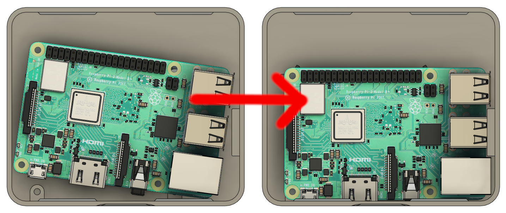

# Enclosure Files

Here are files for an enclosure (currently Pi 3 only) should you
wish to 3D print it. The ultrasonic sensor mounts on the underside of
the cover through the cat's eyes using the 2 standoffs and 2 M2x8 screws.
The Pi mounts to the body with 4 M2.5x8 screws. The body mounts to the
wall via 2 #6 or #8 screws/anchors.

If you're having trouble getting the Pi in place, try rotating it into
position as shown here:

