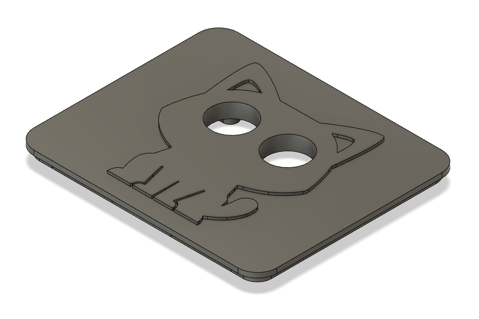

# Enclosure Files

Here are .stl files for a Pi Zero enclosure should you wish to 3D print
it. The ultrasonic sensor mounts on the underside of the cover through
the cat's eyes. The base mounts to the wall via 2 screws.

Pretty much any enclosure will work as long as the sensor is exposed and
kept in place.

